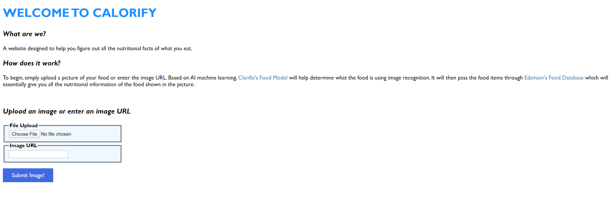
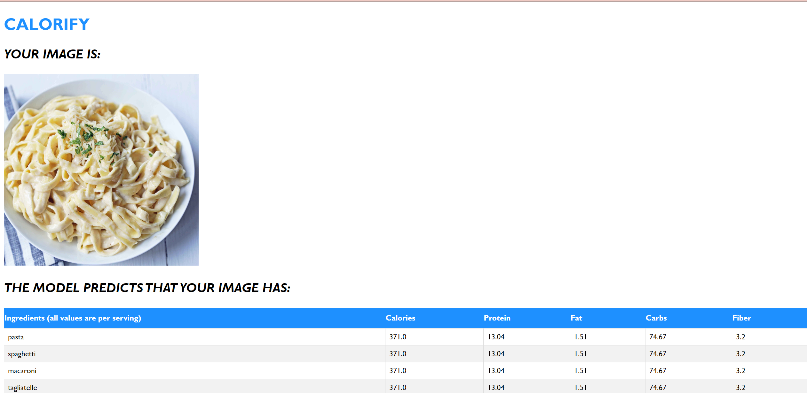

# Calorify

  

Calorify is an app that allows a user to upload an image, and returns to the user nutritional information on the predicted ingredients in the image.

  

# Setting it up

  

Calorify is a flask app that uses the Clarifai API to predict ingredients in your food. To set it up for running locally or for development, follow the steps below.

  

### 1. Installing python 3

Type `python --version` in your terminal. Make sure that you have python 3 installed.

If you do not have python 3, install it from [here]([https://www.python.org/downloads/])

### 2. Cloning the repo

cd into the location of your choice, then type

`git clone https://github.com/zoeechengg/pythonproject-zc.git`.

### 3. (Optional) Creating a virtualenv

Creating a virtualenv allows you to manage your python modules and dependencies cleanly between projects.

  

To create a virtualenv navigate to the calorify folder (e.g. `Users/your_user/pythonproject-zc/calorify`) and

on Mac/Linux, type

`python3 -m venv venv` in your project folder

on Windows, type

`py -3 -m venv venv`

  

Then, to activate your virtualenv

on Mac/Linux, type `source venv/bin/activate`

on Windows, type `venv\Scripts\activate`

  

Your terminal or shell should change end with a `(venv)` to reflect that you're now in the virtual environment.

### 4. Installing dependencies

  

Calorify requires a bunch of external modules to work. To install them, cd into the `calorify` folder if you're not already in there, and type `pip install -r requirements.txt`

### 5. Run the app!

Simply type `flask run`, and your app should be up an running. Happy hacking!